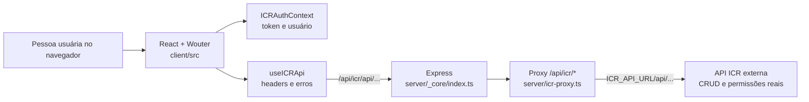
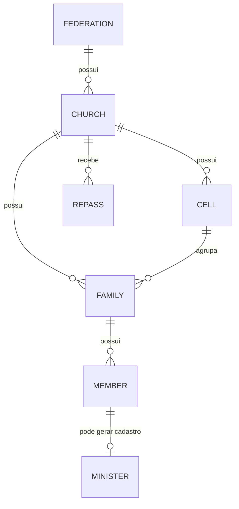

# Guia de continuidade para desenvolvimento — ICR Gestão de Secretaria

Este documento é a porta de entrada técnica do projeto. Ele foi escrito para alguém que está começando com TypeScript e React, mas precisa alterar o sistema com segurança.

> **Resumo em uma frase:** este repositório é uma interface React que gerencia secretaria de igrejas e chama uma **API ICR externa**; o servidor Node local existe principalmente para servir a interface e encaminhar essas chamadas sem expor a URL interna da API.

## 1. Antes de alterar qualquer coisa

### Estado encontrado no repositório

- A branch atual é `main` e o remoto é `origin` no GitHub.
- Havia alterações locais em `client/src/pages/Family.tsx` e arquivos ainda não versionados em `docs/` quando este guia foi criado. **Elas não fazem parte deste guia e não devem ser descartadas sem confirmar com quem as fez.**
- Os comandos de validação estão temporariamente impedidos pelo ambiente instalado, não necessariamente pelo código da aplicação:
  - `npm run check` para em `tsconfig.json`, pois `ignoreDeprecations: "6.0"` não é aceito pelo TypeScript local 5.9.3;
  - `npm test` não consegue o acesso de leitura de que o `esbuild` precisa para abrir `vitest.config.ts` neste ambiente.

Quando trabalhar na sua máquina ou em CI, rode sempre, nesta ordem:

```powershell
pnpm install --frozen-lockfile
pnpm check
pnpm test
pnpm build
```

Use `pnpm`, não `npm`, para instalar dependências: há um `pnpm-lock.yaml`, que é o registro exato das versões usadas pelo projeto. Não apague `node_modules` ou o lockfile para “consertar” um erro sem entender a causa.

### Arquivos que você não deve editar por impulso

| Local | Motivo |
|---|---|
| `client/src/components/ui/` | Componentes-base copiados do ecossistema shadcn/Radix. Reutilize-os; altere-os somente se uma mudança for realmente global. |
| `pnpm-lock.yaml` | Muda apenas quando uma dependência é adicionada, removida ou atualizada de propósito. |
| `drizzle/0000_*.sql` e `drizzle/meta/` | Histórico de migrações do banco local de OAuth. Não é o banco do domínio ICR. |
| `API.json` | Contrato OpenAPI da API ICR. Trate-o como documentação recebida da API, não como implementação do backend. |
| `patches/wouter@3.7.1.patch` | Correção aplicada a uma dependência; trocar a versão do Wouter exige revisar esse patch. |

## 2. Tecnologias e responsabilidades

| Tecnologia | Onde aparece | Para que serve aqui |
|---|---|---|
| TypeScript | todo `.ts`/`.tsx` | Evita passar dados de formato incorreto entre funções e API. |
| React 19 | `client/src` | Constrói a tela com componentes e estado. |
| Vite | `vite.config.ts` | Servidor de desenvolvimento e build do frontend. |
| Wouter | `client/src/App.tsx` | Rotas do navegador, como `/members`. |
| Tailwind CSS | `className="..."` | Estilos em classes; não há CSS separado para cada página. |
| Sonner | chamadas `toast.*` | Mensagens de sucesso e erro no canto da tela. |
| Express | `server/_core/index.ts` | Servidor Node que serve a aplicação e hospeda o proxy. |
| Axios | `server/icr-proxy.ts` | Repassa requisições do navegador à API ICR. |
| Fetch | `useICRApi.ts` | Faz as chamadas autenticadas no frontend. |
| Drizzle/MySQL/tRPC | `server/db.ts`, `drizzle/`, `server/routers.ts` | Estrutura herdada de OAuth e recursos genéricos; não é usada pelos cadastros de igreja atuais. |
| Vitest | `server/*.test.ts` | Testes automatizados. |

## 3. A arquitetura que realmente está em uso



### Por que o proxy é obrigatório?

O navegador só conversa com o mesmo endereço onde a tela foi aberta. Por isso o frontend usa sempre `/api/icr/...`, uma URL relativa. O Express recebe essa chamada e a envia para `ICR_API_URL`, que pode ser, por exemplo, `http://icr-api:8080` dentro do Docker. Isso evita CORS, mantém a URL interna fora do navegador e centraliza o tratamento de falhas.

**Regra principal:** em qualquer tela nova, chame `fetchApi('/api/...')` de `useICRApi`. Nunca coloque `http://localhost:8080`, IP, domínio da API ou token diretamente em uma página.

### Dois blocos que coexistem

O projeto veio de um template que possui uma camada própria de OAuth/tRPC/Drizzle. Ela continua no repositório, mas os cadastros atuais usam a API ICR por REST.

| Código | Estado prático | Como agir |
|---|---|---|
| `client/src/pages/*`, `ICRAuthContext`, `useICRApi`, `icr-proxy.ts` | **Ativo e central** | É o caminho normal para alterar funcionalidades. |
| `client/src/main.tsx`, `server/routers.ts`, `server/_core/trpc.ts` | Ativo no bootstrap, mas pouco utilizado | Não remova sem plano de migração; o tRPC ainda é inicializado. |
| `client/src/_core/hooks/useAuth.ts`, `DashboardLayout.tsx` | Herdado/não usado pelas rotas atuais | Não escolha este padrão para telas novas. |
| `drizzle/schema.ts`, `server/db.ts`, OAuth em `server/_core` | Usado somente se o OAuth interno for adotado | Não crie entidades de membro/família aqui: elas pertencem à API ICR. |
| `ComponentShowcase.tsx`, `AIChatBox.tsx`, LLM/voz/mapa/armazenamento em `server/_core` | Demonstração ou infraestrutura não conectada às telas de secretaria | Só trabalhe aqui mediante uma funcionalidade explícita. |

## 4. Como a aplicação inicia — leitura linha a linha dos arquivos centrais

As referências abaixo usam as linhas atuais do arquivo. Linhas de JSX que só criam `div`, `label` e `input` repetem a mesma regra: o elemento é renderizado, `className` define a aparência Tailwind e um `on...` liga um evento à função indicada.

### 4.1 `server/_core/index.ts` — processo Node e rotas HTTP

| Linhas | O que cada instrução faz |
|---|---|
| 1 | `dotenv/config` lê `.env` antes de qualquer acesso a `process.env`. |
| 2–10 | Importam Express, servidor HTTP, verificação de portas, middleware tRPC, rotas OAuth, proxy ICR e Vite. Importar não executa a rota; apenas traz a função para este arquivo. |
| 13–20 | `isPortAvailable` cria um servidor temporário, tenta ouvir uma porta e devolve `true` se conseguiu ou `false` no evento de erro. O `Promise` permite usar `await`. |
| 22–29 | `findAvailablePort` tenta da porta pedida até mais 19 portas. `throw` interrompe a inicialização se nenhuma puder ser usada. |
| 31–78 | `startServer` monta a aplicação. `express()` cria o app; `createServer(app)` permite que Vite e Express compartilhem o mesmo HTTP server. |
| 40–41 | Os dois parsers convertem corpos JSON e formulários em `req.body`; o limite de 50 MB atende upload, mas deve ser revisto se houver abuso de memória. |
| 44 | Registra callback OAuth legado. |
| 47–53 | Expõe tRPC em `/api/trpc`, com `appRouter` e o contexto que descobre o usuário. |
| 57 | Registra o proxy; daí qualquer `/api/icr/*` será tratado por `icrProxyRouter`. |
| 62–66 | Em desenvolvimento o Vite entrega o frontend e atualiza a tela; em produção, arquivos já compilados em `dist/public` são servidos. |
| 68–76 | Lê `PORT` (3000 por padrão), escolhe uma porta livre e inicia o servidor. |
| 78 | Executa a função e imprime qualquer erro não tratado. |

### 4.2 `server/icr-proxy.ts` — a ponte para a API ICR

O arquivo parece grande porque aceita respostas de login em formatos diferentes. A parte normal de qualquer CRUD está nas linhas 239–295.

| Linhas | O que fazem |
|---|---|
| 14–18 | Importam o roteador Express, Axios e `ENV`; exportam um roteador isolado. |
| 21 | Define o prefixo público que o frontend usa: `/api/icr`. |
| 23 | Identifica especificamente a rota de login, a única que recebe enriquecimento de dados. |
| 25–73 | Funções defensivas: transformam `unknown` em objeto, convertem strings/números em IDs válidos e removem strings vazias. Elas existem porque a API pode responder `id`, `value`, `code`, `memberId` etc. |
| 75–99 | `extractTokenFromLoginResponse` procura token no cabeçalho e, depois, em vários nomes possíveis no corpo. Remove `Bearer ` se existir. |
| 101–231 | `enrichLoginResponse` consulta função do usuário, membro, família e igreja quando a resposta de login vier incompleta. Assim o frontend recebe `memberId`, `familyId`, `churchId` e `federationId` para aplicar o escopo. Cada `catch` intencionalmente mantém o login funcionando se o enriquecimento falhar. |
| 239 | `all` atende todos os verbos HTTP no padrão `/api/icr/*`. |
| 241–245 | Remove o prefixo, cria a URL de destino e preserva a query string. Ex.: `/api/icr/api/members?page=1` vira `ICR_API_URL/api/members?page=1`. |
| 248–253 | Constrói headers mínimos e encaminha `Authorization` quando o navegador o enviou. |
| 255–262 | Monta a configuração Axios: método original, URL, headers, corpo para requisições que não são GET, resposta sem exceção para status 4xx/5xx e timeout de 60 s. |
| 265–278 | Faz a chamada. No login bem-sucedido, extrai token e acrescenta dados de escopo à resposta; em outras rotas, devolve o status e JSON sem transformá-los. |
| 279–294 | Converte falha de conexão em 503 com uma mensagem útil; qualquer outro erro inesperado vira 500. |

**Ponto de atenção:** o proxy registra URL, headers de resposta e outros detalhes no console. Antes de produção, revise esses logs para não registrar dados desnecessários.

### 4.3 `client/src/main.tsx` — entrada do React

| Linhas | Explicação |
|---|---|
| 1–9 | Importam o cliente tRPC, React Query, serializador `superjson`, componente raiz e CSS global. |
| 11 | `new QueryClient()` cria o cache de requisições para tRPC/React Query. |
| 13–24 | `redirectToLoginIfUnauthorized` só reage a um `TRPCClientError` cuja mensagem seja a constante de não autenticado; nesse caso muda `window.location.href`. |
| 26–40 | Inscreve-se nos caches de query e mutation. Quando há erro, tenta redirecionar se necessário e imprime o erro no console. |
| 42–53 | Cria o cliente tRPC para `/api/trpc`; `credentials: 'include'` permite enviar cookies. O `superjson` preserva tipos ricos como `Date`. |
| 55–62 | Localiza `<div id="root">` em `client/index.html` e renderiza `App` dentro dos providers de tRPC e React Query. O `!` diz ao TypeScript que o elemento existe. |

### 4.4 `client/src/App.tsx` — providers, rotas e proteção

| Linhas | Explicação |
|---|---|
| 1–23 | Importam infraestrutura, páginas e o roteador Wouter. Cada import de página corresponde a uma possível tela. |
| 25–50 | `ProtectedRoute`: aguarda a recuperação da sessão; sem token redireciona a `/login`; com token, calcula o escopo e impede que a URL abra uma rota não permitida. Só então renderiza a página recebida em `component`. |
| 52–90 | `Router`: a tabela real de URLs. Rotas em inglês são as canônicas; as rotas antigas em português apenas redirecionam, preservando links já distribuídos. A última rota captura URL desconhecida e manda para `/`. |
| 92–107 | `App`: envolve todo o sistema em `ErrorBoundary`, tema, autenticação, dados compartilhados de ministros, tooltips e toasts. A ordem importa: qualquer filho só pode chamar `useICRAuth` porque está dentro de `ICRAuthProvider`. |

### 4.5 `client/src/contexts/ICRAuthContext.tsx` — sessão

| Parte | Explicação detalhada |
|---|---|
| `ICRUser` (linhas 4–13) | É o formato mínimo que a interface espera. `scope` é `unknown` porque a API pode devolvê-lo como número, texto ou objeto. |
| `ICRAuthContextType` (15–24) | É o contrato entregue pelo provider: usuário, token, flags, login, logout e mensagem de erro. |
| Funções `toRecord`, `parse...` (28–72) | São adaptadores de resposta. Não inventam dados: apenas aceitam diferentes nomes/formatos e retornam valor seguro ou `undefined`. |
| `extractUserFromLoginResponse` (74–132) | Escolhe onde está o usuário (`user`, `data.user`, `data` ou raiz), coleta IDs, nome e escopo e usa o nome digitado como fallback. |
| `enrichUserFromDirectory` (134–172) | Busca o cadastro de usuário por username para completar IDs ou escopo ausentes. |
| `enrichUserChurchContext` (174–266) | Se houver membro, busca membro → família → igreja, construindo a cadeia que determina em qual igreja/federação o usuário está. |
| `useEffect` do provider (278–305) | Ao abrir a página, lê `icr_token` e `icr_user` do `localStorage`; se existirem, mostra a sessão imediatamente e a enriquece em segundo plano. |
| `login` (307–365) | Envia usuário/senha ao proxy, trata resposta de erro, acha o token em vários formatos, extrai/enriquece usuário e salva token e usuário no estado e no `localStorage`. `finally` sempre desliga o loading. |
| `logout` (367–372) | Limpa estado e as duas chaves de armazenamento; não chama uma API de logout da ICR. |
| JSX final (374–392) | Disponibiliza o valor a todos os filhos e `useICRAuth` falha cedo se alguém o usar fora do provider. |

**Segurança:** token em `localStorage` é simples, mas pode ser exposto se houver XSS. Não renderize HTML não confiável, evite `dangerouslySetInnerHTML` e trate uma futura migração para cookie `httpOnly` como melhoria de segurança.

### 4.6 `client/src/hooks/useICRApi.ts` — a única porta de CRUD

| Linhas | Explicação |
|---|---|
| 14–22 | `normalizeApiPath` garante `/` no início e traduz o parâmetro antigo `pageSize` para `size`. |
| 25–74 | O hook lê `token` e `logout` do contexto e cria `fetchApi<T>`. O `<T>` permite que a chamada declare o resultado esperado, por exemplo `fetchApi<Member[]>`. |
| 30–37 | Cria `Content-Type: application/json`, mescla headers extras e inclui `Authorization: Bearer <token>` se houver sessão. |
| 40–43 | Executa `fetch` para `API_BASE + normalizedPath`; `API_BASE` vale sempre `/api/icr`. |
| 45–48 | Em 401, remove a sessão e lança erro para a página avisar o usuário. |
| 50–66 | Produz mensagens melhores para 403 e 503 e transforma qualquer outro status não OK em `Error`. |
| 68–70 | Lê texto primeiro: resposta vazia vira `{}`; resposta existente é convertida de JSON para `T`. |
| 79 em diante | Declara interfaces de dados devolvidos pela API. Elas são contrato de leitura para a interface, não validação em tempo de execução. |

## 5. Domínio: entidades, enumerações e relacionamentos



| Entidade | Tela | Campos de ligação importantes |
|---|---|---|
| Federação/Área | `Federations.tsx` | Pode ter `ministerId`; agrupa igrejas. |
| Igreja | `Churchs.tsx` | Tem `federationId`, endereço e ministro responsável. |
| Célula | `Cell.tsx` | Tem `churchId` e opcionalmente `responsibleId`. |
| Família | `Family.tsx` | Tem `churchId`, `cellId`, `manId`, `womanId` e data de casamento. |
| Membro | `Members.tsx` | Tem `familyId`, gênero, cargo, nascimento e telefone. |
| Ministro | `Ministers.tsx` | Complementa um `memberId` quando o cargo é Pastor ou Presbítero. |
| Repasse | `Repass.tsx` | Liga `churchId`, `reference` e `amount`. |
| Usuário/Função | `UserRole.tsx` | Liga conta, membro, escopo e papéis. |

### Valores numéricos que não devem ser adivinhados

O arquivo `API.json` afirma os seguintes enums:

| Campo | Valores |
|---|---|
| `CellType` | `0` Célula; `1` Comunidade Missionária. |
| `GenderType` | `1` masculino; `2` feminino. |
| `MemberRole` | `0` sem função; `1` Pastor; `2` Presbítero; `3–12` demais funções definidas em `lib/member-roles.ts`. |
| `UserScope` | `0` local; `1` federado; `2` federação/nacional. |

Centralize novos rótulos/validações de cargos em `client/src/lib/member-roles.ts`; não espalhe números mágicos em páginas.

## 6. Escopos e permissões

`client/src/lib/scope-access.ts` é o mapa de autorização visual. Ele existe em três níveis:

| Nível | Pode ver/editar na interface | Como é identificado |
|---|---|---|
| `local` | Dados da própria igreja; não vê Administração nem Ministérios de federação. | Escopo `0`, texto não reconhecido ou contexto padrão. |
| `federated` | Igrejas da própria federação/área; não vê páginas exclusivas da federação. | Escopo `1` ou palavras “federada/comissão”. |
| `federation` | Tudo. | Escopo `2`, username administrativo ou texto de admin. |

### Leitura do arquivo, por blocos

- `normalizeScopeValue` aceita número, texto ou objeto e tenta obter um valor comparável.
- `getScopeLevel` converte a variação recebida em um dos três níveis. Primeiro respeita enum numérico; depois usa nomes conhecidos.
- `FEDERATION_ONLY_PATHS` lista URLs bloqueadas para níveis abaixo de `federation`.
- `canAccessPathByScope` é usado tanto no menu quanto em `ProtectedRoute`. Assim, esconder um link não é a única barreira visual.
- `resolveScopeRestrictions` calcula IDs bloqueados e igrejas permitidas para filtros e formulários. Para local ele tenta `user.churchId`, depois família do usuário, depois membro → família. Para federado usa a federação do usuário; para nacional permite todas.

**Regra de segurança:** isso é proteção de interface, não autorização definitiva. A API ICR deve continuar validando o token e o escopo. Nunca considere seguro liberar uma ação no backend só porque a página escondeu o botão.

## 7. Padrão de uma tela CRUD

As telas de Federação, Igreja, Célula, Família, Membro, Ministro e Repasse seguem a mesma receita. A melhor referência curta é `client/src/pages/Cell.tsx`.

### Leitura orientada de `Cell.tsx`

| Linhas | O que acontece |
|---|---|
| 1–10 | Importa hooks do React, layout, tabela, seletores, contexto, utilitários de escopo, tipos/API e toasts. Cada import existe porque será usado abaixo; remova import não usado. |
| 12–17 | `CelulaForm` é o estado editável. Usar `number | ''` permite que um `<select>` comece vazio, sem mentir que já há um ID. |
| 19–22 | Opções fixas do enum `CellType`. |
| 24–43 | Normaliza um valor de tipo que pode chegar como string ou número e o converte para rótulo amigável. `??` fornece fallback apenas para `null`/`undefined`. |
| 45–50 | Remove acentos, espaços externos e diferença de maiúsculas para comparar nomes de célula sem falsos duplicados. |
| 52–64 | Traduz mensagens técnicas comuns do banco/API em português útil. |
| 66–87 | Componente da página. Cada `useState` guarda uma parcela da tela: dados, loading, modal, item em edição, formulário, listas auxiliares, paginação e filtros. `scopeLevel` é derivado, não estado duplicado. |
| 88–130 | `load` busca todos os dados necessários. `Promise.allSettled` deixa a lista principal abrir mesmo se, por exemplo, ministros falharem. Só a falha de células interrompe a tela. `settledValue` converte promessa rejeitada em `undefined`. |
| 132 | Chama `load` uma vez ao montar a tela. Se você acrescentar dependências usadas por `load`, considere `useCallback` para evitar aviso de dependências. |
| 134–143 | `openAdd` limpa edição, cria formulário inicial e fixa a igreja quando o usuário é local. |
| 145–154 | `openEdit` transforma os dados do registro no formato que os controles da tela entendem e abre o modal. |
| 156–199 | `handleSave`: valida nome/igreja, impede nome duplicado, transforma strings em números, decide `PATCH` quando existe `editItem` ou `POST` para criação, fecha modal e recarrega a lista. `finally` é essencial para liberar o botão mesmo com erro. |
| 201–204 | Exclusão: delega a confirmação para `CRUDTable`, chama `DELETE` e recarrega. |
| 206–216 | Descreve as colunas; `render` permite calcular o texto de uma coluna sem alterar o dado original. |
| 218 em diante | Calcula restrições, filtra dados conforme escopo e renderiza `ICRLayout`, `CRUDTable`, filtros e modal. A maior parte são controles JSX conectados a `form` e `setForm`. |

### O que cada expressão React recorrente significa

```tsx
const [data, setData] = useState<Member[]>([]);
```

- `data` é o valor atual.
- `setData` é a única função que deve substituí-lo.
- `<Member[]>` instrui TypeScript que o estado é uma lista de membros.
- `[]` é o valor inicial antes da API responder.

```tsx
setForm((previous) => ({ ...previous, name: value }));
```

- A forma com função usa o estado mais recente, evitando corrida entre atualizações.
- `...previous` copia todos os campos anteriores.
- `name: value` substitui somente `name`; nunca muta o objeto antigo.

```tsx
await fetchApi(`/api/cells/${editItem.id}`, {
  method: 'PATCH',
  body: JSON.stringify(body),
});
```

- Template string substitui `${editItem.id}` pelo ID real.
- `await` espera a resposta; sem ele a tela poderia mostrar sucesso antes de salvar.
- `PATCH` altera apenas os campos enviados.
- `JSON.stringify` converte o objeto JavaScript em corpo HTTP JSON.

### Componentes reutilizáveis

| Componente | O que faz | Cuidados |
|---|---|---|
| `ICRLayout` | Menu, sessão, suporte e área de conteúdo. | O menu também filtra itens por escopo. |
| `CRUDTable` | Busca local/servidor, tabela, paginação, ações e confirmação de exclusão. | Passe `onSearch` somente quando a API fizer a busca; se não, ela filtra objetos localmente. |
| `SmartSelect` | Seletor pesquisável com debounce de 300 ms e paginação infinita. | `fetchItems(page, query)` deve devolver até 10 itens no formato `{ id, name }`. |
| `MultiSelect` | Tags de múltipla escolha construídas sobre `SmartSelect`. | Atualmente recupera os nomes selecionados chamando `fetchItems(1, '')`; atenção se a API tiver muitos resultados. |
| `DateInputWithPaste` e `date-utils` | Campo de data e conversão sem fuso horário. | Para aniversário/casamento use data pura `YYYY-MM-DD`; não faça `new Date('YYYY-MM-DD')`. |
| `useViaCEP` | Preenche rua/cidade/UF para CEP brasileiro. | É uma chamada externa do navegador; trate erro e não dependa dela para salvar. |

## 8. Particularidades das telas mais importantes

### Família: uma operação composta

`Family.tsx` é a tela mais delicada. Ao criar família ela pode também criar marido e esposa e, conforme o cargo, o registro de ministro.

1. `handleSave` valida o nome, igreja permitida e telefones (linhas 491–542).
2. Cria a família com `POST /api/families` (559–564).
3. Cria os membros selecionados usando `createMemberForFamily` (429–461 e 569–570).
4. Se criar um membro falhar, tenta excluir a família recém-criada (572–578). Isso é uma **compensação**, não uma transação real: se a exclusão também falhar, podem restar dados parciais.
5. Para Pastor/Presbítero, cria ou atualiza ministro (581–597).
6. Atualiza a família com `manId` e `womanId` (599–606).

Ao mudar esse fluxo, preserve a ordem. Alterar membros antes de saber o `familyId` não funciona. A melhoria ideal de longo prazo é uma operação transacional no backend: `POST /families-with-members`, em vez de vários requests no frontend.

### Membros e ministros

`Members.tsx` decide se precisa de cadastro adicional de ministro pela função `shouldAutoCreateMinister`: cargo Pastor (`1`) ou Presbítero (`2`). `saveMinisterForMember` procura primeiro um ministro com o mesmo `memberId`; se existir usa `PATCH`, caso contrário `POST`.

As validações importantes são:

- telefone é normalizado e validado por país;
- mulher não pode receber cargo definido em `MALE_ONLY_ROLE_VALUES`;
- CPF brasileiro, quando informado para ministro, precisa ter 11 dígitos;
- CEP brasileiro, quando informado para ministro, precisa ter 8 dígitos.

### Dashboard

`useDashboardScope.ts` concentra a lógica do dashboard e é melhor que colocar `fetch` diretamente em `Home.tsx`.

| Escopo escolhido | Endpoints |
|---|---|
| Nacional | `/api/v1/dashboard/national`, classes e cargos nacionais. |
| Federação | `/api/v1/dashboard/federation/{id}`, classes e cargos da federação. |
| Área | Reutiliza os endpoints de federação hoje; há um TODO explícito até a API oferecer endpoints próprios. |
| Igreja | `/api/v1/dashboard/church/{id}`, classes e cargos da igreja. |

O hook cancela efeitos antigos com a flag `cancelled`. Isso evita que uma resposta lenta de um filtro antigo sobrescreva dados de um filtro que o usuário acabou de escolher.

### Datas, repasses, usuários e ministros

| Página | Função principal | Endpoints próprios relevantes |
|---|---|---|
| `DatesMembers.tsx` | Agrega aniversários e casamentos por mês e igreja. | `/api/members/birthdays/{month}/church/{churchId}`, `/api/families/wedding/month/{month}` |
| `DatesMinister.tsx` | Lista aniversário/casamento de ministros. | `/api/ministers/birthdays/month/{month}`, `/api/ministers/weddings/month/{month}` |
| `Repass.tsx` | Controla repasse por igreja e competência. | `/api/repasses`, `/api/repasses/reference/{id}`, `/api/repasses/references` |
| `UserRole.tsx` | Cria usuários, papéis e atribuições. | `/api/user-roles/users`, `/roles`, `/assign` |
| `Ministers.tsx` | CRUD específico do registro adicional de ministro. | `/api/ministers` |
| `MinistersInsurance.tsx` | Visualiza/edita cobertura de seguro. | Reaproveita lista e `PATCH /api/ministers/{id}` |
| `Profile.tsx` | Atualiza a conta da pessoa logada. | Busca por username e altera `/api/user-roles/users/{id}` |

## 9. Contrato REST da API ICR

`API.json` é a fonte local de verdade para os endpoints que o frontend pode chamar. Cada recurso principal usa este padrão:

| Recurso | Listar/criar | Buscar/alterar/excluir | Corpo de criação |
|---|---|---|---|
| Federação | `GET`/`POST /api/federations` | `GET`/`PATCH`/`DELETE /api/federations/{id}` | `name`, `ministerId` |
| Igreja | `GET`/`POST /api/churches` | `GET`/`PATCH`/`DELETE /api/churches/{id}` | `name`, `address`, `federationId`, `ministerId` |
| Célula | `GET`/`POST /api/cells` | `GET`/`PATCH`/`DELETE /api/cells/{id}` | `name`, `type`, `churchId`, `responsibleId` |
| Família | `GET`/`POST /api/families` | `GET`/`PATCH`/`DELETE /api/families/{id}` | `name`, `churchId`, `cellId`, `manId`, `womanId`, `weddingDate` |
| Membro | `GET`/`POST /api/members` | `GET`/`PATCH`/`DELETE /api/members/{id}` | `familyId`, `name`, `gender`, `birthDate`, `hasBeenMarried`, `role`, `cellPhone` |
| Ministro | `GET`/`POST /api/ministers` | `GET`/`PATCH`/`DELETE /api/ministers/{id}` | `memberId`, dados ministeriais, endereço e seguro |
| Repasse | `GET`/`POST /api/repasses` | `GET`/`PATCH`/`DELETE /api/repasses/{id}` | `churchId`, `reference`, `amount` |

Para adicionar uma chamada, confira no `API.json` três coisas: método HTTP, schema do request (`*DTO` ou `*PatchDTO`) e schema da resposta. Não infira nomes como `insurance` versus `isInsured`: o projeto já lida com ambas as respostas por compatibilidade, mas o contrato deve ser definido pela API.

## 10. Como implementar uma funcionalidade sozinho

### Caso A: adicionar um campo a um formulário existente

Exemplo: adicionar `apelido` a membro, supondo que a API passe a aceitar esse campo.

1. Atualize o contrato da API ou confirme a versão recebida no `API.json`.
2. Acrescente o campo à interface `MembroForm` em `Members.tsx`.
3. Dê valor inicial no `useState` do formulário.
4. Preencha-o em `openEdit`, para a edição não apagar o dado existente.
5. Inclua o controle JSX ligado ao estado: `value={form.apelido}` e `onChange={(e) => setF('apelido', e.target.value)}`.
6. Valide em `handleSave` antes de `setSaving(true)`.
7. Acrescente ao `body` enviado por POST/PATCH.
8. Se a API o devolver, atualize a interface `Member` de `useICRApi.ts` e a coluna da tabela.
9. Teste criar, editar, recarregar e verificar o dado com os três escopos.

### Caso B: adicionar uma página CRUD

1. Copie a estrutura de `Cell.tsx`, não uma página de demonstração.
2. Defina a interface de formulário e os tipos que a API devolverá em `useICRApi.ts`.
3. Carregue lista e dependências em uma função `load` que trate loading/erro.
4. Implemente `openAdd`, `openEdit`, `handleSave` e `handleDelete`.
5. Monte `columns` e passe tudo a `CRUDTable`.
6. Escolha a política de escopo: atualize `canAccessPathByScope`, `resolveScopeRestrictions` e o menu de `ICRLayout` se necessário.
7. Importe a página em `App.tsx` e registre uma `<Route>` canônica. Adicione alias em português só se houver necessidade real.
8. Adicione testes de transformação/validação; não teste apenas se o botão aparece.

### Caso C: adicionar endpoint ao servidor local

Só faça isso quando a API ICR **não** for a dona do dado. Para o domínio de igreja, o normal é evoluir a API ICR, documentar em `API.json` e apenas chamar pelo proxy. A estrutura tRPC existe, mas criar uma segunda fonte de dados para membros/famílias tornaria o sistema inconsistente.

## 11. Convenções que evitam bugs

1. **Datas sem fuso:** aniversário e casamento são data civil. Use `parseDateOnly`, `formatDateOnly` e strings `YYYY-MM-DD`; não use `new Date` para “corrigir” data.
2. **IDs de inputs:** mantenha `number | ''` no estado e converta com `Number(...)` apenas ao montar o payload. Isso distingue campo vazio de ID `0`.
3. **Estado imutável:** sempre `setX(previous => ({ ...previous, campo: valor }))`; não faça `form.nome = valor`.
4. **Await e finally:** toda ação que bloqueia botão deve ter `try/catch/finally`, ou o botão pode ficar preso em loading após erro.
5. **Erro útil ao usuário:** mensagem técnica no console se necessário; toast curto e compreensível na tela.
6. **Tipos antes de `any`:** quando a resposta é incerta, prefira `unknown` + uma função de parse como as da autenticação. `any` desliga a proteção do TypeScript.
7. **Permissões em duas camadas:** filtre a interface para boa experiência, mas confie a segurança à API ICR.
8. **Não duplique URL/token:** `API_BASE` e `useICRApi` são o ponto único.
9. **Faça requests paralelos com critério:** `Promise.all` quando tudo é obrigatório; `Promise.allSettled` quando dados auxiliares podem falhar sem inutilizar a página.

## 12. Dívida técnica e pontos para investigar antes de grandes mudanças

Estes itens são observações do código atual; não altere todos de uma vez.

| Prioridade | Observação | Impacto recomendado |
|---|---|---|
| Alta | A validação de TypeScript está quebrada por `ignoreDeprecations: "6.0"` com TypeScript 5.9.3. | Corrigir/revisar em uma alteração pequena e validar com instalação limpa. |
| Alta | Criação de família + membros usa várias requisições e rollback compensatório no cliente. | Levar a transação ao backend quando houver oportunidade. |
| Média | Há muitos `console.log` de diagnóstico em Home, dashboard, tabela, membros, datas e proxy. | Remover/colocar logger configurável antes de produção. |
| Média | A visão “Área” usa os mesmos endpoints da federação. | Ajustar quando a API publicar endpoints próprios. |
| Média | `ComponentShowcase`, `DashboardLayout` e boa parte de `server/_core` não participam do fluxo usado. | Mapear ou remover só em uma limpeza planejada, com testes. |
| Média | Token é guardado em `localStorage`. | Planejar cookie `httpOnly` ou mitigação de XSS, sem quebrar login existente. |
| Baixa | `MultiSelect` recupera dados selecionados apenas pela primeira página. | Criar busca por IDs caso seleções antigas não apareçam. |

## 13. Testes que valem a pena escrever

Os testes existentes cobrem logout tRPC, formatação de telefone e alguns cenários de proxy. Para novas alterações, priorize:

- funções puras: datas, telefone, enum de cargo, cálculo de escopo;
- payload de criação/edição: o objeto enviado à API deve ter campo, tipo e ID corretos;
- regra de sexo/cargo;
- fallback de escopo local com igreja/família/membro;
- fluxo de família quando a criação de um membro falha;
- mapeamento de resposta inesperada da API, principalmente login.

Evite testes que dependam da API ICR real. Faça mock de `fetchApi` ou do `fetch` e teste o contrato esperado.

## 14. Checklist para entregar uma alteração

- [ ] Entendi se o dado pertence à API ICR ou à estrutura local legada.
- [ ] Usei `useICRApi`, URL relativa e `Authorization` automático.
- [ ] Atualizei tipo, estado inicial, edição, validação, payload e exibição.
- [ ] Testei criar, editar, excluir/cancelar e recarregar.
- [ ] Testei com usuário local, federado e federativo quando a tela tem escopo.
- [ ] Testei desktop e celular; `ICRLayout` muda o menu abaixo de 1024 px.
- [ ] Rodei `pnpm check`, `pnpm test` e `pnpm build` em ambiente com dependências corretas.
- [ ] Não incluí token, senha, `.env` ou logs sensíveis no commit.
- [ ] Revisei o diff para garantir que não levei alterações alheias, especialmente em `Family.tsx` e `docs/`.

## 15. Ordem recomendada para estudar

1. Leia `package.json`, `.env.example` e este guia.
2. Abra `client/src/main.tsx`, `App.tsx`, `ICRAuthContext.tsx` e `useICRApi.ts` nessa ordem.
3. Leia `server/_core/index.ts` e `server/icr-proxy.ts` para entender a fronteira com a API.
4. Siga uma ação simples em `Cell.tsx`: botão Novo → `handleSave` → proxy → API → `load`.
5. Estude `scope-access.ts` antes de mexer em filtros, menus ou permissões.
6. Só então entre em `Family.tsx`, `Members.tsx`, `Repass.tsx` e `UserRole.tsx`, que concentram regras mais complexas.

Se você mantiver esta ordem e os checklists acima, conseguirá fazer alterações pequenas com confiança e saberá quando uma demanda precisa ser resolvida na API ICR, não neste frontend.
