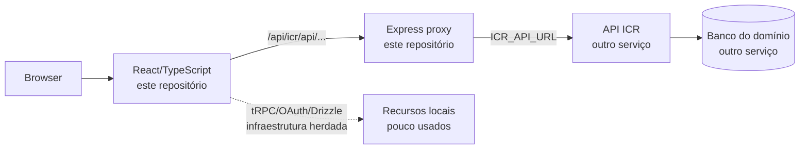
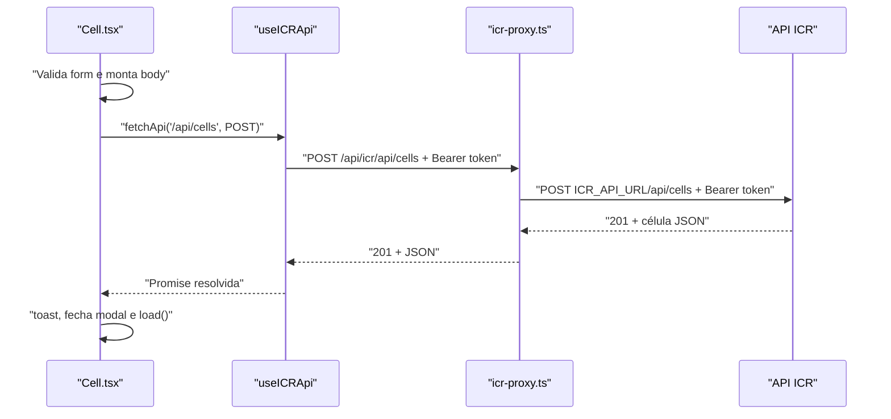

# Guia do projeto para desenvolvedor ASP.NET backend

Este guia é para você que já entende APIs, autenticação, DTOs, bancos e arquitetura de backend em ASP.NET, tem boa base de JavaScript, mas ainda não trabalha no dia a dia com React e TypeScript.

O objetivo não é ensinar JavaScript do zero. É traduzir a arquitetura deste projeto para conceitos que você já conhece e permitir que você entregue alterações de frontend com segurança.

> **Modelo mental principal:** este projeto é o equivalente a uma aplicação ASP.NET que hospeda uma SPA React e possui um BFF/proxy muito fino. A regra de negócio e o banco do domínio ICR estão em outra API; este repositório é, na prática, o cliente administrativo dela.

Para uma visão completa da estrutura e dos endpoints, consulte também [GUIA_DESENVOLVEDOR.md](GUIA_DESENVOLVEDOR.md).

## 1. Tradução rápida: ASP.NET para este projeto

| Conceito ASP.NET | Equivalente neste projeto | Arquivo principal |
|---|---|---|
| `Program.cs` / bootstrap da aplicação | Inicialização do Express e servidor HTTP | `server/_core/index.ts` |
| Middleware | `app.use(...)` | `server/_core/index.ts` |
| Controller/endpoint intermediário | Roteador Express | `server/icr-proxy.ts` |
| `HttpClient` com delegating handler | Axios no proxy; `fetchApi` no browser | `server/icr-proxy.ts`, `useICRApi.ts` |
| DTO | Interface TypeScript | `client/src/hooks/useICRApi.ts` |
| ViewModel de formulário | Interface `*Form` + estado React | Ex.: `MembroForm` em `Members.tsx` |
| Razor view / componente Blazor | Componente React `.tsx` | `client/src/pages/*.tsx` |
| Router do ASP.NET | Wouter | `client/src/App.tsx` |
| DI / serviço com escopo | React Context + custom hook | `ICRAuthContext.tsx`, `useICRApi.ts` |
| `IActionFilter` / política de autorização | `ProtectedRoute` + `scope-access.ts` | `App.tsx`, `scope-access.ts` |
| `appsettings.json` + variáveis de ambiente | `.env` e `process.env` | `.env.example`, `server/_core/env.ts` |
| EF Core migrations | Drizzle migrations | `drizzle/` — legado para OAuth, não para o domínio ICR |
| Testes xUnit | Vitest | `server/*.test.ts` |

## 2. O que está e o que não está neste repositório



### Consequência prática

Se a demanda for “adicionar campo a Membro”, o caminho normal é:

1. Confirmar se a **API ICR** aceita/devolve o campo.
2. Alterar o DTO/interface e o formulário React neste repositório.
3. Nunca criar uma tabela Drizzle para armazenar uma segunda cópia de `Member` localmente.

Se você está acostumado a começar criando entidade + migration + controller, pare e pergunte: **o dado pertence ao backend ICR ou a esta interface?** Para famílias, membros, células, igrejas, ministros e repasses, a resposta é a API ICR.

## 3. Stack que você precisa conhecer

Você não precisa dominar todas as dependências antes de começar. Estas são as que importam para uma alteração de tela:

| Tecnologia | O que você já sabe que ajuda | O que aprender aqui |
|---|---|---|
| TypeScript | JavaScript, DTOs e tipos C# | Union types, generics, type narrowing e interfaces apagadas em runtime. |
| React | Componentes Blazor ajudam como referência | `useState`, `useEffect`, props, renderização condicional e composição. |
| Wouter | Rotas MVC/minimal APIs | URL no cliente, `<Route>` e `<Redirect>`. |
| Tailwind | CSS básico | Classes utilitárias no atributo `className`; não há arquivo CSS por página. |
| Sonner | `TempData`/notificação de UI | `toast.success` e `toast.error` após ações. |
| Fetch/Axios | `HttpClient` | Promise, `await`, status HTTP e serialização JSON. |

## 4. TypeScript para quem pensa em C#

### Interfaces são DTOs, mas não existem em runtime

```ts
export interface Member {
  id: number;
  name: string;
  familyId?: number;
}
```

Isso se parece com:

```csharp
public sealed class MemberDto
{
    public required int Id { get; init; }
    public required string Name { get; init; }
    public int? FamilyId { get; init; }
}
```

Mas há uma diferença decisiva: a interface TypeScript desaparece quando o código roda no navegador. Portanto, isto:

```ts
const member = await fetchApi<Member>('/api/members/1');
```

informa ao compilador qual formato esperamos; **não valida** a resposta real. Quando uma resposta externa é incerta, faça parse explícito de `unknown`, como a autenticação já faz com `toRecord`, `parseNumberOrUndefined` e `parseIdFromRecord`.

### `undefined`, `null` e string vazia não são a mesma coisa

| Valor | Significado comum neste projeto |
|---|---|
| `undefined` | Não enviar o campo; permite que a API mantenha/compute seu comportamento. |
| `null` | Limpar relação ou valor opcional, quando a API aceita. |
| `''` | Campo de formulário ainda vazio; usado porque inputs HTML trabalham com texto. |

Exemplo real:

```ts
interface CelulaForm {
  churchId: number | '';
}

const body = {
  churchId: Number(form.churchId),
  responsibleId: form.responsibleId ? Number(form.responsibleId) : null,
};
```

`churchId` precisa ser preenchido e vira número. `responsibleId` é opcional; se vazio, é enviado como `null` para remover o responsável.

### `Record<string, unknown>` é um objeto sem contrato confiável

Pense em `Dictionary<string, object?>`, com a vantagem de `unknown` obrigar a validar antes de usar. O projeto o usa para payloads que podem receber campos opcionais:

```ts
const body: Record<string, unknown> = { name: form.name };
if (form.birthDate) body.birthDate = form.birthDate;
```

Não substitua `unknown` por `any`: `any` é equivalente a desligar a checagem de tipo naquele valor.

### Generics de chamada HTTP

```ts
const families = await fetchApi<Family[]>('/api/families');
```

Leia como o equivalente conceitual de:

```csharp
var families = await httpClient.GetFromJsonAsync<List<FamilyDto>>("/api/families");
```

O `T` em `fetchApi<T>` é o tipo que a função devolve ao código chamador.

## 5. React para quem vem de backend

### Uma página é uma função que devolve UI

```tsx
export default function Celulas() {
  const [data, setData] = useState<Cell[]>([]);

  return <CRUDTable data={data} />;
}
```

O raciocínio é:

1. `Celulas` é executada para produzir a representação atual da tela.
2. `useState<Cell[]>([])` cria estado persistente entre renderizações: a lista começa vazia.
3. Ao chamar `setData(novaLista)`, React executa o componente de novo.
4. A nova execução passa os dados atualizados para `CRUDTable`.

Não há `ViewBag`, `ModelState` ou alteração direta do DOM. Você descreve como a UI deve ficar para o estado atual; React sincroniza a tela.

### `useState` é estado de tela, não uma variável comum

```tsx
const [saving, setSaving] = useState(false);
```

- `saving` controla se o botão deve ficar desabilitado.
- `setSaving(true)` agenda uma nova renderização.
- Não faça `saving = true`; a variável local é recriada em toda renderização e o React não saberia atualizar a tela.

Para atualizar um objeto, copie o anterior:

```tsx
setForm((previous) => ({ ...previous, name: event.target.value }));
```

O operador `...` é semelhante a criar uma cópia com `with` em C#:

```csharp
form = form with { Name = value };
```

Evite isto:

```tsx
form.name = value; // mutação: pode não renderizar e causa bugs
```

### `useEffect` é efeito colateral após renderização

```tsx
useEffect(() => {
  load();
}, []);
```

Equivale conceitualmente a “ao montar esta tela, execute `load`”. O array vazio significa que o efeito não depende de nenhum valor mutável e roda uma vez durante a montagem.

```tsx
useEffect(() => {
  load();
}, [page, pageSize]);
```

Aqui `load` deve ser executado novamente quando página ou tamanho de página mudarem. A lista de dependências deve conter os valores externos usados dentro do efeito; é a proteção contra usar uma versão antiga de estado.

### JSX não é HTML puro

```tsx
<input
  value={form.name}
  onChange={(event) => setForm((old) => ({ ...old, name: event.target.value }))}
  className="w-full border rounded-lg"
/>
```

| Trecho | O que significa |
|---|---|
| `value={form.name}` | Input controlado: o valor vem do estado React. |
| `onChange={...}` | Em toda digitação, atualiza o estado. |
| `event.target.value` | Texto atual do input. |
| `className` | Em React se usa `className`, não `class`. As palavras são classes Tailwind. |
| `{...}` | Dentro de JSX, abre uma expressão JavaScript. |

## 6. O fluxo completo de uma ação de salvar

Vamos seguir “criar célula”, porque é o fluxo CRUD mais simples.



O código central em `Cell.tsx` é:

```tsx
const body = {
  name: trimmedName,
  type: form.type === '' ? undefined : form.type,
  churchId: Number(form.churchId),
  responsibleId: form.responsibleId ? Number(form.responsibleId) : null,
};

if (editItem) {
  await fetchApi(`/api/cells/${editItem.id}`, {
    method: 'PATCH',
    body: JSON.stringify(body),
  });
} else {
  await fetchApi('/api/cells', {
    method: 'POST',
    body: JSON.stringify(body),
  });
}
```

Linha por linha:

1. `body` é o DTO que será serializado; não é o estado inteiro da tela.
2. `trimmedName` evita salvar espaços antes/depois do nome.
3. `type === '' ? undefined : type` omite tipo vazio do JSON, em vez de enviar string inválida.
4. `Number(...)` converte valor de input/select para número de ID.
5. O ternário do responsável envia `null` para relação opcional vazia.
6. `editItem` existe apenas quando o modal foi aberto para edição.
7. Em edição, a URL inclui o ID e o verbo é `PATCH`.
8. Em criação, a URL é a coleção e o verbo é `POST`.
9. `JSON.stringify` é o equivalente da serialização feita por `PostAsJsonAsync`.
10. `await` impede que a tela siga para mensagem de sucesso antes da resposta.

## 7. Autenticação e autorização

### Sessão no browser

`ICRAuthContext.tsx` é o serviço de sessão do frontend. Ele:

1. Envia `username` e `password` para `POST /api/v1/auth/login` por meio do proxy.
2. Extrai um JWT de vários formatos possíveis de resposta.
3. Busca dados complementares do usuário, membro, família e igreja.
4. Guarda token e usuário no estado React e no `localStorage`.
5. Oferece `useICRAuth()` para qualquer componente dentro do provider.

Uso em uma página:

```tsx
const { user, token, logout, isAuthenticated } = useICRAuth();
```

O equivalente mental é injetar um serviço de sessão, mas o Context só existe dentro da árvore React já envolvida em `ICRAuthProvider`.

### Autorização visual e autorização real

`scope-access.ts` filtra menu, rotas e opções por nível:

- `local`: própria igreja;
- `federated`: igrejas da própria federação/área;
- `federation`: visão nacional/administrativa.

Isso é comparável a esconder links conforme uma policy. Porém, a segurança real deve estar na API ICR. O frontend pode ser alterado pelo usuário; portanto, não trate `ProtectedRoute` como substituto de `[Authorize]`.

## 8. Onde colocar cada mudança

| Demanda | Primeiro arquivo a abrir | Arquivos que normalmente acompanham |
|---|---|---|
| Rota/tela nova | `client/src/App.tsx` | página em `pages/`, menu em `ICRLayout.tsx`, regras em `scope-access.ts` |
| Novo endpoint da API ICR | `API.json` para consultar contrato | tipo em `useICRApi.ts`, chamada na página |
| Campo de formulário | página responsável | interface do formulário, estado inicial, `openEdit`, payload, tabela |
| Regra de cargo/gênero | `client/src/lib/member-roles.ts` | `Members.tsx`, `Family.tsx`, possivelmente `Ministers.tsx` |
| Formatação de telefone/CEP | `client/src/lib/country.ts` | formulário específico |
| Regra de data | `client/src/lib/date-utils.ts` | use data pura, sem conversão de fuso |
| Escopo e filtros de igreja | `client/src/lib/scope-access.ts` | página, menu, rota e dashboard se aplicável |
| Proxy/conexão da API | `server/icr-proxy.ts` | `.env.example`, `server/_core/env.ts` |
| Estilo de um controle global | componente em `client/src/components/` | evite mexer em `components/ui/` sem necessidade global |

## 9. Roteiro de estudo recomendado

Leia nesta ordem e execute uma ação simples no sistema enquanto acompanha o código:

1. `package.json`: scripts e dependências.
2. `.env.example` e `server/_core/env.ts`: configuração do processo Node.
3. `server/_core/index.ts`: equivalente a `Program.cs`.
4. `server/icr-proxy.ts`: entenda a fronteira com a API ICR.
5. `client/src/main.tsx`: entrada do React.
6. `client/src/App.tsx`: providers e rotas.
7. `client/src/contexts/ICRAuthContext.tsx`: login e contexto de usuário.
8. `client/src/hooks/useICRApi.ts`: cliente HTTP padrão.
9. `client/src/pages/Cell.tsx`: página CRUD de referência.
10. `client/src/lib/scope-access.ts`: restrições de autorização visual.
11. `Family.tsx` e `Members.tsx`: fluxos compostos e regras do domínio.

## 10. Primeiro exercício seguro

Antes de uma demanda real, faça uma alteração visual pequena em uma branch:

1. Em `Cell.tsx`, localize a definição de colunas.
2. Adicione uma coluna somente de leitura, por exemplo um texto derivado do tipo de célula.
3. Observe como `render: (item) => ...` recebe cada registro.
4. Confira a tela, desfaça ou mantenha a alteração conforme necessário.

Isso ensina props, lista, callback e renderização sem tocar em payload, API ou dados persistidos.

Depois, faça um exercício de regra pura: adicione um teste Vitest para uma função em `country.ts` ou `member-roles.ts`. É a parte mais parecida com teste unitário de serviço C# e oferece retorno rápido.

## 11. Checklist antes de abrir um pull request

- [ ] O dado é da API ICR, e não do banco local Drizzle.
- [ ] A chamada usa `useICRApi` e caminho `/api/...`, nunca URL de servidor no componente.
- [ ] O formulário preserva campo em criação e edição.
- [ ] O payload respeita o DTO documentado em `API.json`.
- [ ] IDs vazios foram tratados antes de `Number(...)`.
- [ ] `try/catch/finally` libera o estado de loading após falha.
- [ ] A autorização foi considerada em menu, rota, filtros e API.
- [ ] Datas não passam por `new Date('YYYY-MM-DD')`.
- [ ] Não há token, senha, `.env` ou dados pessoais em log/commit.
- [ ] Você validou em uma instalação correta com `pnpm check`, `pnpm test` e `pnpm build`.

## 12. Diferenças que mais causam estranhamento

| Hábito de backend | Ajuste necessário no frontend |
|---|---|
| Pensar em request isolado | A tela mantém estado por vários segundos/minutos; trate loading, erro, dados antigos e interação do usuário. |
| Validação só no servidor | Valide no cliente para experiência, mas mantenha a API como autoridade. |
| Atualizar objeto em memória | Em React crie novo objeto/lista e use o setter. |
| Retornar página depois de POST | Após POST, o componente fecha modal, mostra toast e atualiza a lista. |
| Confiar no tipo do DTO | TypeScript não valida JSON recebido. Use `unknown` + parser se o backend puder variar. |
| CSS em arquivo separado | A maior parte do estilo está em `className` com Tailwind. |
| Controller por recurso | O recurso ICR já está em outra API; aqui normalmente há apenas componente + chamada HTTP. |

Com essas equivalências, o projeto deixa de ser “um frontend desconhecido” e vira uma SPA com um BFF fino, contratos REST conhecidos e componentes de UI com estado explícito.
